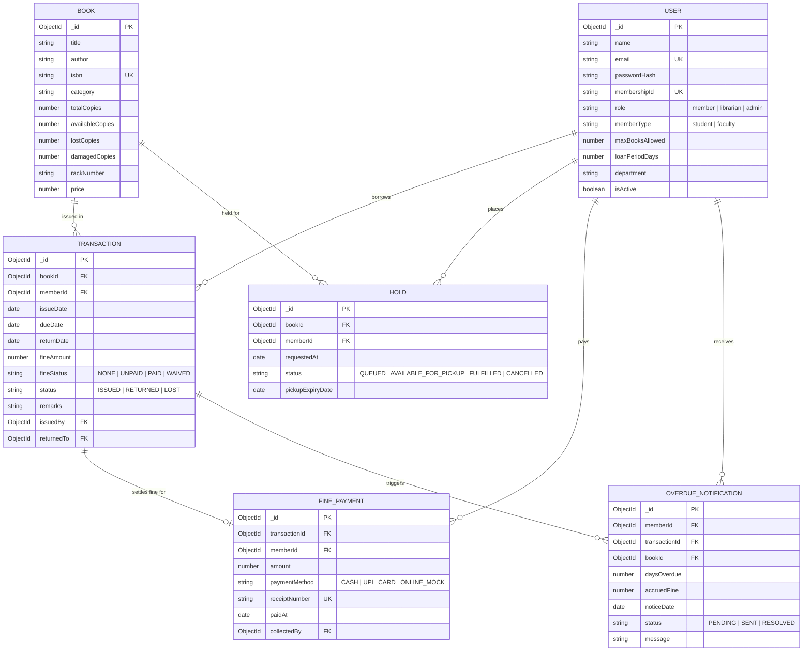

# P05 — Digital Library Management System
**Advanced JavaScript Backend Frameworks (Node.js & Express JS)**  
*Continuous Internal Assessment - 3 (CIA-3) • 5th Semester • Christ University*

---

## 👥 Mandatory Team Details

| S.No | Student Name | Roll No. | Department | Section |
|:---:|:---|:---:|:---|:---:|
| 1 | Janhavi J | 2462182 | Computer Science(AIML) | Section C |
| 2 | Jemimah Anna Anil | 2462080 | Computer Science(AIML) | Section C |
| 3 | Jewin Jinson | 2462084 | Computer Science(AIML) | Section C |
| 4 | Issac Limson | 2462077 | Computer Science(AIML) | Section C |

- **Project Code & Title**: P05 — Digital Library Management System
- **Domain**: Education
- **Course**: Advanced JavaScript Backend Frameworks (Node.js & Express JS)
- **GitHub Repository**: [https://github.com/Janhavi-559/LnT-5th-sem-ese.git]

---

## 📖 Business Overview & Problem Statement
University libraries traditionally face major operational bottlenecks due to manual register-based book issuing, static borrowing quotas, misplaced return records, and human calculation errors for overdue fines.

The **Digital Library Management System (DLMS)** is a high-performance, enterprise-grade backend developed with Node.js, Express.js, and MongoDB (Mongoose ODM). It delivers an automated, audit-proof circulation engine featuring:
- Role-based workflows for **Students**, **Faculty**, **Librarians**, and **System Administrators**.
- Precise due-date computation and automated daily fine calculation.
- First-In, First-Out (FIFO) **Hold/Reservation Queue** for out-of-stock titles.
- Fine payment settlement with official digital receipt generation and administrative waiver capabilities.
- Real-time **Overdue Delinquency Scans** with automated reminder record generation.
- Real-time MongoDB aggregation analytics for library inventory health, financial revenues, and circulation trends.

---

## 🛠️ Technology Stack
- **Runtime**: Node.js (v18+)
- **Web Framework**: Express.js (v4.x)
- **Database & ODM**: MongoDB with Mongoose ODM (Includes embedded persistent fallback for zero-friction evaluation!)
- **Authentication**: JSON Web Tokens (`jsonwebtoken`) with `bcryptjs` password hashing
- **Validation**: Request body middleware validation via `express-validator`
- **Frontend / Demo**: Responsive Single-Page Application (HTML5, CSS3, Vanilla JS) embedded directly in Express
- **API Testing**: Postman Collection (v2.1) + Standalone automated E2E test runner (`test-api.js`)

---

## 🏗️ System Architecture & MVC Directory Structure
The codebase strictly adheres to the industry-standard **Model-View-Controller (MVC)** architectural pattern:

```
lms/
├── config/
│   ├── db.js                     # Robust MongoDB connection with zero-config fallback
│   └── constants.js              # Roles, statuses, loan limits, fine rates
├── models/
│   ├── User.js                   # Users, credentials, roles, membership limits
│   ├── Book.js                   # Books catalog, copies & inventory stats
│   ├── Transaction.js            # Borrow/return records, due dates, fines
│   ├── Hold.js                   # FIFO reservation queue
│   ├── FinePayment.js            # Official receipts & cashier audit logs
│   └── OverdueNotification.js    # Overdue alerts & dispatch logs
├── middleware/
│   ├── auth.js                   # JWT authentication & role-based authorization (RBAC)
│   ├── validate.js               # express-validator request validation
│   └── errorHandler.js           # Centralized API error handler (consistent JSON)
├── utils/
│   ├── apiError.js               # Custom operational error class
│   └── membershipIdGenerator.js  # Sequential membership ID generator (e.g. MEM-2026-0001)
├── controllers/
│   ├── authController.js         # Register, Login, Current User Profile
│   ├── bookController.js         # Book CRUD, catalog search, inventory copy counts
│   ├── transactionController.js  # Issue book, Return book, Lost copy report
│   ├── holdController.js         # Place hold, cancel hold, queue inspection
│   ├── fineController.js         # Fine payments, waive fines, user fine summary
│   ├── notificationController.js # Overdue notification generation & history
│   ├── reportController.js       # Admin/Librarian aggregated analytics & reports
│   └── userController.js         # Admin account management for librarians & members
├── routes/
│   ├── authRoutes.js             # /api/auth
│   ├── bookRoutes.js             # /api/books
│   ├── transactionRoutes.js      # /api/transactions
│   ├── holdRoutes.js             # /api/holds
│   ├── fineRoutes.js             # /api/fines
│   ├── notificationRoutes.js     # /api/notifications
│   ├── reportRoutes.js           # /api/reports
│   └── userRoutes.js             # /api/users
├── public/                       # Interactive Web Demo UI (Single-Page Dashboard)
│   ├── index.html                # Modern responsive UI with live role switcher
│   ├── css/style.css             # Polished CSS & modern theme
│   └── js/app.js                 # API interactions & dynamic dashboard
├── postman/
│   └── P05_Digital_Library_Management_System.postman_collection.json # Postman v2.1
├── seed.js                       # Standalone database seeder script
├── test-api.js                   # Automated E2E test runner for all 13 modules
├── .env.example                  # Safe template for environment variables
├── .gitignore                    # Git hygiene (node_modules, .env excluded)
├── server.js                     # Express app setup and server entry point
├── package.json                  # Node dependencies and npm scripts
└── README.md                     # Comprehensive academic documentation
```

---

## 🗄️ Database Schema & Entity Relationships



### Database Design Decisions: Referencing vs. Embedding
- **Referencing (`ObjectId` with `ref`)**: Chosen for `Book`, `User`, `Transaction`, `Hold`, and `FinePayment`.
  * *Rationale*: Library transactions and hold queues continuously grow over time. Embedding transaction arrays inside a `User` document would quickly bloat the document, risk breaching MongoDB's 16MB BSON limit, and create write-lock contention during simultaneous checkouts.
- **Selective Embedding**: Status states (`fineStatus`, `status`), copy sub-counts (`lostCopies`, `damagedCopies`), and policy defaults are maintained directly as concise attributes to support atomic, zero-overhead updates.

---

## 🚀 Installation & Local Setup

### 1. Clone the Repository
```bash
git clone <your-repository-url>
cd lms
```

### 2. Install Dependencies
```bash
npm install
```

### 3. Configure Environment Variables
Copy the `.env.example` template:
```bash
cp .env.example .env
```
*(The default configuration points to `mongodb://127.0.0.1:27017/digital_library_db`. If a local MongoDB daemon is not running, the system will seamlessly initialize an embedded persistent database in `.mongo-data/` automatically!)*

### 4. Seed Database with Realistic Demo Data
```bash
npm run seed
```

### 5. Start the Application
```bash
npm start
# or for live reloading during development:
npm run dev
```
Open your browser and navigate to **`http://localhost:5000`** to access the interactive web dashboard!

### 6. Run Automated End-to-End Tests
```bash
npm test
```

---

## 🔑 Demo Evaluation Credentials

| Role | Email | Password | Persona & Purpose |
|---|---|---|---|
| **System Admin** | `admin@library.edu` | `Admin@123` | Full access, analytics, user & librarian management |
| **Librarian** | `sarah.librarian@library.edu` | `Lib@12345` | Circulation desk, issue/return, fine waiver, stock adjustments |
| **Student Member** | `alex.student@christ.in` | `Student@123` | Active on-time loan, hold reservations, browsing |
| **Student Member (Overdue)** | `priya.student@christ.in` | `Student@123` | Active overdue loan with calculated fines & notification |
| **Faculty Member** | `dr.anand@christ.in` | `Faculty@123` | Extended quota (8 books, 30 days loan period) |

---

## 📋 Comprehensive Functional Modules Mapping (All 13 Modules)

| # | Module Name | Method & Endpoint | Access / Role | Description & Business Rules |
|---|---|---|---|---|
| **1** | **Member Registration & Auth** | `POST /api/auth/register`<br>`POST /api/auth/login`<br>`GET /api/auth/profile` | Public<br>Public<br>Authenticated | Issues unique sequential `MEM-2026-XXXX` ID. Hashes passwords with bcrypt (10 rounds). Issues signed JWT token. |
| **2** | **Book Catalog Management** | `POST /api/books`<br>`GET /api/books`<br>`GET /api/books/:id`<br>`PUT /api/books/:id`<br>`DELETE /api/books/:id` | Librarian/Admin<br>All<br>All<br>Librarian/Admin<br>Librarian/Admin | Complete CRUD. Prevents duplicate ISBNs. Deletion blocked if active issued transactions exist. |
| **3** | **Catalog Search & Filtering** | `GET /api/books/search` | All | Search across title, author, category, ISBN. Query params: `q`, `category`, `availableOnly=true`, `page`, `limit`. |
| **4** | **Book Issue Workflow** | `POST /api/transactions/issue` | Librarian/Admin | Enforces membership quota (Student: 3, Faculty: 8). Decrements copies. Computes due date. Honors hold queue priority. |
| **5** | **Book Return & Fine Calculation** | `PUT /api/transactions/:id/return` | Librarian/Admin | Computes overdue days: `max(0, returnDate - dueDate)`. Applies rate (Student: ₹10/day, Faculty: ₹5/day). Promotes waiting holds. |
| **6** | **Reservation / Hold Queue** | `POST /api/holds`<br>`GET /api/holds/my-holds`<br>`DELETE /api/holds/:id`<br>`GET /api/holds/book/:bookId` | Member/Staff<br>Member<br>Member/Staff<br>Staff | Allows holds on out-of-stock titles. Maintains FIFO queue. Prevents duplicate holds or holds on already-borrowed books. |
| **7** | **Membership Plans & Limits** | `GET /api/users/plans`<br>`PUT /api/users/:id/plan` | Public<br>Admin | Standardizes rules: Student (3 books, 14 days) vs Faculty (8 books, 30 days). Admin can assign custom limits. |
| **8** | **Fine Payment Tracking** | `POST /api/fines/pay`<br>`GET /api/fines/my-fines`<br>`GET /api/fines/unpaid`<br>`PUT /api/fines/:transactionId/waive` | Authenticated<br>Member<br>Staff<br>Staff | Records payments (UPI, Cash, Card). Generates official receipt `REC-2026-XXXXXX`. Supports fine waiver with reason logging. |
| **9** | **Overdue Notification Records** | `POST /api/notifications/generate-overdue`<br>`GET /api/notifications` | Staff<br>Authenticated | Automated batch scan of active loans past due date. Generates audit records with accrued fine & member alert text. |
| **10** | **Inventory & Copy Management** | `PUT /api/books/:id/inventory`<br>`POST /api/transactions/:id/report-lost` | Staff<br>Staff | Adjusts total, available, and damaged copies. Marks lost copies, updates inventory, charges book price replacement fine. |
| **11** | **Member Borrowing History** | `GET /api/transactions/my-history`<br>`GET /api/transactions/member/:memberId` | Member<br>Staff | Complete transaction history with issue dates, return dates, fine amounts, and payment status. |
| **12** | **Librarian/Admin Reports** | `GET /api/reports/most-borrowed`<br>`GET /api/reports/overdue-summary`<br>`GET /api/reports/inventory-health`<br>`GET /api/reports/financials` | Staff<br>Staff<br>Staff<br>Admin | High-efficiency MongoDB aggregation pipelines for top titles, overdue delinquency risks, inventory health, and fine revenues. |
| **13** | **Role-Based Access Control** | Middleware: `protect`, `authorize('admin', 'librarian')`<br>`POST /api/users/librarian`<br>`PATCH /api/users/:id/status` | Admin | Granular access control. Members cannot access staff circulation routes. Admin manages staff accounts & suspensions. |

---

## 📬 Postman Collection Testing Guide
An exported Postman v2.1 collection is included in:
`postman/P05_Digital_Library_Management_System.postman_collection.json`

### Steps to Test via Postman:
1. Open Postman and click **Import**.
2. Select `postman/P05_Digital_Library_Management_System.postman_collection.json`.
3. In collection variables, verify `baseUrl` is set to `http://localhost:5000`.
4. Run request `1.1 Login as Admin` — this script automatically captures and sets the JWT token in variables!
5. Run the requests sequentially to verify all 13 modules.

---

## 📄 License
Academic Project developed for **Christ University CIA-3 (Advanced JavaScript Backend Frameworks)**. All rights reserved.
